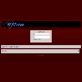

NEXTengine - A lightweight, fully featured, and easily customizable forum engine based on NodeJS.
================================================================================================

About
----------
NEXTengine is a simple but fully featured forum engine powered by NodeJS; designed to be simple, fast, and reliable. All pages are dynamically generated and recieve data using a MySQL database.

Screenshots
------------
[](docs/screenshots/NEscreenshot1.png)
[](docs/screenshots/NEscreenshot2.png)
[](docs/screenshots/NEscreenshot4.png)
[](docs/screenshots/NEscreenshot5.png)
[](docs/screenshots/NEscreenshot7.png)
[](docs/screenshots/NEscreenshot8.png)
[](docs/screenshots/NEscreenshot9.png)
[](docs/screenshots/NEscreenshot10.png)
[](docs/screenshots/NEscreenshot11.png)
[](docs/screenshots/NEscreenshot12.png)

Features
----------
- User
  - Users can register using the registration page.
  - Users can also change their username and password using the included profile page.
- Boards
  - Boards are subsections of thread that allows for thread categorization based on specific topic.
  - Admin can add new boards to the site using the control panel.
- Threads
  - Users can easily create new threads.
  - Admin can easily delete unwanted threads.
  - Image uploads are *required* for threads to better promote discussion.
  - Threads can contain a large number of replies and easily facilitiate conversation.
- Replies
  - Users can quickly and easily reply to their favorite (or least favorite) threads.
  - Images are *optional* for replies, but allowed.
- Admin Controls
  - Posts and threads can be deleted by the admin using the control panel.
  - New boards can be created using the control panel.


Requirements
----------------
1.  NodeJS
2.  MySQL
3.  
### Node JS Plugins
1.  ExpressJS >= 4.18.1
2.  Multer >= 1.4.4
3.  MySQL2 >= 2.3.3


Installation
----------------
1. Download NEXTengine to your desired directory (or use git clone).
2. Run ```npm install``` within the root directory of the NEXTengine files.
3. Create an empty MySQL database called ```forum_db```.
4. Insert your MySQL username, password, and database name into the ```.env``` file within the root NEXTengine directory
5. Use the command ```npm run dev``` to start the server.
6. NEXTengine should be active on port 3000, the initial admin username and password combination is **admin / admin**.


Features to be added
--------------------------
- Improved board customization.
- Ability to ban users.
- Crossposting (having the same thread on multiple boards).


ERD Diagram
----------------------


